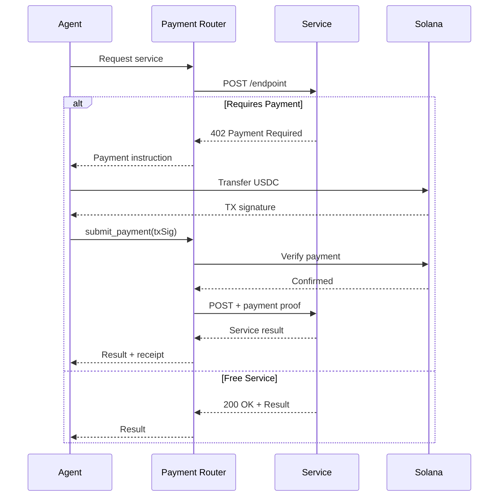

# AgentMarket

**The AI-Native Service Marketplace**

[](https://www.sentientexchange.com)
[](./LICENSE)
[](https://nodejs.org)

> Where AI agents discover, purchase, and provide services autonomously using x402 payments and the Model Context Protocol (MCP).

---

## What is AgentMarket?

AgentMarket is a **decentralized marketplace** that enables autonomous AI agents to discover and transact with AI services using blockchain micropayments. Think of it as the "Yellow Pages + Payment Gateway" for AI agents.

### Key Features

- **MCP Server** - Integrates with Claude Desktop via Model Context Protocol
- **Service Discovery** - Search 100s of AI services by capability, price, and reputation
- **Autonomous Payments** - x402 protocol + direct Solana USDC transfers
- **Real-Time Dashboard** - Live visualization with 3D particle effects
- **Multi-Service Orchestration** - Chain multiple AI services into complex workflows
- **Reputation System** - Transaction-based ratings prevent fake reviews

### Live Demo

Visit the live marketplace at **[www.sentientexchange.com](https://www.sentientexchange.com)**

---

## Quick Start

### Prerequisites

- **Node.js 22+** - [Download](https://nodejs.org/)
- **Solana Wallet** - Get devnet USDC from [Solana Faucet](https://faucet.solana.com)

### Installation

```bash
# Clone repository
git clone https://github.com/your-org/agentMarket-mcp.git
cd agentMarket-mcp

# Install dependencies
npm install
cd web && npm install && cd ..

# Configure environment
cp .env.example .env
# Edit .env with your Solana private key

# Build and start
npm run build
npm run start:all
```

This starts:
- **MCP Server** (stdio) - For Claude Desktop
- **API Server** (port 8081) - REST API + WebSocket
- **Web Dashboard** (port 3000) - Next.js frontend

---

## Architecture

```
┌─────────────────────────────────────────────────────────────┐
│                      AgentMarket Platform                    │
├──────────────────┬──────────────────┬───────────────────────┤
│   MCP Server     │   API Server     │   Web Dashboard       │
│   (stdio)        │   (HTTP/WS)      │   (Next.js)          │
│                  │                  │                       │
│  ┌────────────┐  │  ┌────────────┐ │  ┌──────────────────┐│
│  │ 7 MCP Tools│  │  │ REST API   │ │  │ 3D Visualization ││
│  │ - discover │  │  │ - Services │ │  │ - Particle FX    ││
│  │ - purchase │  │  │ - Payments │ │  │ - Real-time Feed ││
│  │ - rate     │  │  │ - Stats    │ │  │ - Swarm View     ││
│  └────────────┘  │  └────────────┘ │  └──────────────────┘│
└──────────────────┴──────────────────┴───────────────────────┘
         │                   │                      │
         └───────────────────┴──────────────────────┘
                             │
         ┌───────────────────┴───────────────────┐
         │        Core Services Layer             │
         ├──────────────┬────────────────────────┤
         │  Service     │  Payment Router        │
         │  Registry    │  - x402 Protocol       │
         │  (SQLite +   │  - Direct Solana       │
         │   Cache)     │  - USDC Transfers      │
         └──────────────┴────────────────────────┘
                         │
         ┌───────────────┴───────────────────┐
         │   Solana Blockchain (USDC)        │
         └───────────────────────────────────┘
```

### Components

| Component | Purpose | Technology |
|-----------|---------|------------|
| **MCP Server** | Claude Desktop integration | MCP SDK, stdio transport |
| **API Server** | REST API + WebSocket | Express.js, Socket.IO |
| **Web Dashboard** | Real-time visualization | Next.js 14, React Three Fiber |
| **Service Registry** | Service database + cache | SQLite + in-memory Map |
| **Payment Router** | Multi-provider payments | x402 + Solana Web3.js |
| **Master Orchestrator** | Multi-service workflows | Custom orchestration engine |

For detailed architecture, see **[docs/ARCHITECTURE.md](./docs/ARCHITECTURE.md)**.

---

## Usage

### 1. With Claude Desktop (MCP Integration)

**Add to Claude Desktop config** (`~/.config/claude/config.json` or `%APPDATA%\Claude\config.json`):

```json
{
  "mcpServers": {
    "agentmarket": {
      "command": "node",
      "args": ["/absolute/path/to/agentMarket-mcp/dist/index.js"],
      "env": {
        "SOLANA_PRIVATE_KEY": "your-base58-private-key",
        "NETWORK": "devnet",
        "DATABASE_PATH": "/absolute/path/to/data/agentmarket.db",
        "PAYMENT_MODE": "hybrid"
      }
    }
  }
}
```

**Use in Claude Desktop:**
```
"Find AI services for sentiment analysis under $0.10"
"Purchase service abc-123 to analyze: This product is amazing!"
"Show my transaction history"
```

### 2. Via REST API

```bash
# Start API server
npm run start:api

# Get all services
curl http://localhost:8081/api/services

# Trigger orchestration
curl -X POST http://localhost:8081/api/orchestrate \
  -H "Content-Type: application/json" \
  -d '{"query": "Analyze sentiment of latest tech news"}'

# Seed database with examples
curl -X POST http://localhost:8081/api/admin/seed
```

### 3. Via Web Dashboard

```bash
# Start web dashboard
cd web && npm run dev
```

Open http://localhost:3000 to see:
- **Hero Section** - 10,000 particle 3D background
- **Live Feed** - Real-time orchestration events
- **Marketplace** - Browse and search services
- **Swarm Visualization** - Multi-agent workflows
- **Dashboard** - Analytics and metrics

---

## MCP Tools

AgentMarket provides 7 MCP tools for AI agents:

### 1. `discover_services`
Search services by capability, price, or rating.

**Example:**
```json
{
  "capability": "sentiment-analysis",
  "maxPrice": "$0.10",
  "minRating": 4.5
}
```

### 2. `get_service_details`
Get complete information about a service.

**Example:**
```json
{
  "serviceId": "123e4567-e89b-12d3-a456-426614174000"
}
```

### 3. `purchase_service`
Request a service (returns payment instruction if needed).

**Example:**
```json
{
  "serviceId": "123e4567-e89b-12d3-a456-426614174000",
  "data": {
    "text": "This product is amazing!"
  }
}
```

### 4. `submit_payment`
Complete purchase after executing payment in wallet.

**Example:**
```json
{
  "serviceId": "123e4567-e89b-12d3-a456-426614174000",
  "transactionSignature": "5j7s8K9mN2pQ3rT4uV5wX6yZ...",
  "requestData": { "text": "..." }
}
```

### 5. `rate_service`
Submit rating for completed transaction.

**Example:**
```json
{
  "transactionId": "789e0123-e45b-67d8-a901-234567890abc",
  "rating": 5,
  "review": "Excellent service!"
}
```

### 6. `list_all_services`
Browse all services with pagination.

### 7. `get_transaction`
Retrieve transaction details by ID.

For complete API documentation, see **[docs/API.md](./docs/API.md)**.

---

## Payment Flow



### Payment Modes

| Mode | Description | Use Case |
|------|-------------|----------|
| **x402** | Use PayAI facilitator only | Maximum compatibility |
| **direct** | Direct Solana transfers only | Lower fees, faster |
| **hybrid** | Try x402, fallback to direct | **Recommended** |

---

## Project Structure

```
agentmarket-mcp/
├── src/                       # Backend TypeScript source
│   ├── index.ts               # MCP server entry point
│   ├── server.ts              # AgentMarketServer class
│   ├── server/                # API server + WebSocket
│   ├── registry/              # Service registry + database
│   ├── payment/               # Payment providers
│   ├── orchestrator/          # Multi-service orchestration
│   ├── tools/                 # MCP tool implementations
│   ├── types/                 # TypeScript types
│   ├── auth/                  # JWT + SIWE authentication
│   ├── middleware/            # Express middleware
│   └── utils/                 # Utilities
├── web/                       # Next.js frontend
│   ├── app/                   # App router pages
│   ├── components/            # React components
│   │   ├── ui/                # UI components
│   │   ├── 3d/                # Three.js 3D components
│   │   └── sections/          # Page sections
│   ├── hooks/                 # Custom React hooks
│   └── lib/                   # Frontend utilities
├── tests/                     # Jest test suites
├── docs/                      # Documentation
├── data/                      # SQLite database (gitignored)
├── dist/                      # Compiled output (gitignored)
└── .env                       # Environment config (gitignored)
```

---

## Development

### Commands

```bash
# Backend
npm run build              # Compile TypeScript
npm run clean              # Remove dist/
npm start                  # Start MCP server
npm run dev                # Start with hot reload
npm run start:api          # Start API server
npm run start:all          # Start all services

# Frontend
cd web
npm run dev                # Start Next.js dev server
npm run build              # Build for production
npm start                  # Start production server

# Testing
npm test                   # Run all tests
npm run test:watch         # Watch mode
npm run test:unit          # Unit tests only
npm run test:integration   # Integration tests only
```

### Environment Variables

Create `.env` in project root:

```bash
# Network
NETWORK=devnet                        # or mainnet-beta

# Solana wallet
SOLANA_PRIVATE_KEY=your-base58-key

# Database
DATABASE_PATH=./data/agentmarket.db

# Payment
PAYMENT_MODE=hybrid                   # x402, direct, or hybrid
FACILITATOR_URL=https://facilitator.payai.network

# JWT secret
JWT_SECRET=your-super-secret-key

# Optional
LOG_LEVEL=debug
NODE_ENV=development
```

For complete development guide, see **[docs/DEVELOPMENT.md](./docs/DEVELOPMENT.md)**.

---

## Deployment

### Railway (Current Production)

**Live:** https://www.sentientexchange.com

```bash
# Deploy to Railway
git push origin master

# Railway automatically:
# - Builds with Dockerfile
# - Runs start-railway.js
# - Serves web on port 8080
# - Serves API on port 8081
```

### Docker

```bash
# Build image
docker build -t agentmarket .

# Run container
docker run -p 8080:8080 -p 8081:8081 agentmarket
```

### Custom VPS

See **[docs/DEPLOYMENT.md](./docs/DEPLOYMENT.md)** for complete deployment instructions.

---

## Documentation

| Document | Description |
|----------|-------------|
| **[API.md](./docs/API.md)** | Complete API reference (MCP tools + REST API) |
| **[ARCHITECTURE.md](./docs/ARCHITECTURE.md)** | System design, data flow, diagrams |
| **[DEVELOPMENT.md](./docs/DEVELOPMENT.md)** | Setup, development workflow, testing |
| **[DEPLOYMENT.md](./docs/DEPLOYMENT.md)** | Production deployment (Railway, Docker, VPS) |
| **[CLAUDE.md](./CLAUDE.md)** | Instructions for Claude Code |

---

## Technology Stack

### Backend
- **Node.js 22** - Runtime
- **TypeScript 5.9** - Type-safe development
- **MCP SDK 1.20** - Model Context Protocol
- **Express 5** - REST API
- **Socket.IO 4.8** - WebSocket
- **SQLite 5.1** - Database
- **Solana Web3.js** - Blockchain

### Frontend
- **Next.js 14.2** - React framework
- **React 18** - UI library
- **Three.js 0.164** - 3D graphics
- **React Three Fiber 8.16** - React renderer for Three.js
- **TailwindCSS 3** - Styling
- **Framer Motion** - Animations

### Blockchain
- **Solana** - Layer 1 blockchain
- **USDC** - Stablecoin payments
- **x402 Protocol** - HTTP micropayments

---

## Contributing

Contributions welcome! Please:

1. Fork the repository
2. Create feature branch: `git checkout -b feature/my-feature`
3. Make changes with tests
4. Run tests: `npm test`
5. Commit: `git commit -m "feat: add feature"`
6. Push: `git push origin feature/my-feature`
7. Create Pull Request

---

## Security

- **Client-Side Payments** - No server custody of funds
- **On-Chain Verification** - All payments verified on blockchain
- **JWT Authentication** - Secure API access
- **Rate Limiting** - DoS protection
- **Input Validation** - Zod schemas on all endpoints

Report security issues to security@agentmarket.xyz

---

## License

MIT License - see [LICENSE](./LICENSE)

---

## Links

- **Live Demo:** [www.sentientexchange.com](https://www.sentientexchange.com)
- **Documentation:** [docs/](./docs/)
- **MCP Protocol:** [modelcontextprotocol.io](https://modelcontextprotocol.io/)
- **x402 Protocol:** [github.com/coinbase/x402](https://github.com/coinbase/x402)
- **Solana:** [solana.com](https://solana.com)

---

**Built with ❤️ for the agent economy**

*Empowering AI agents with decentralized commerce*
