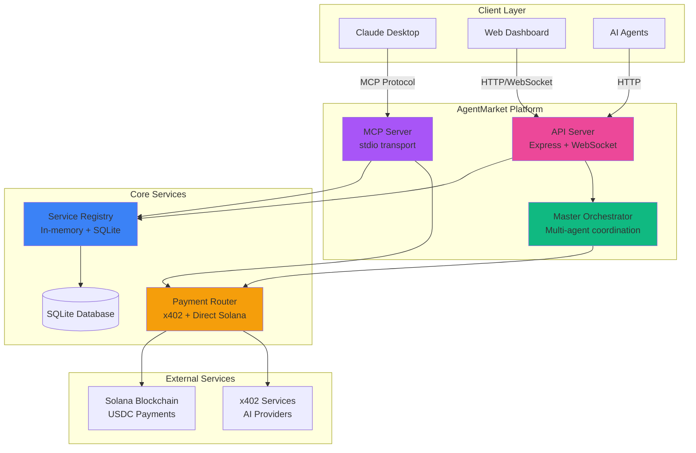
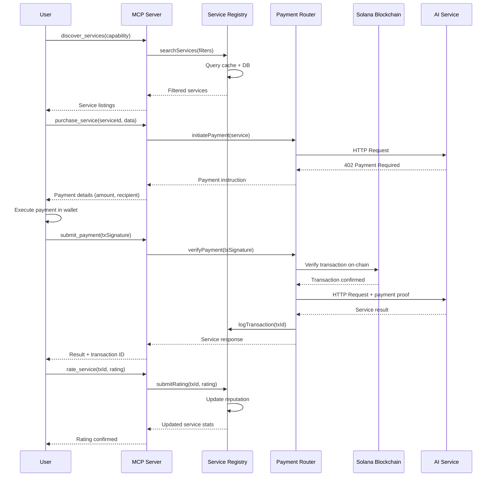
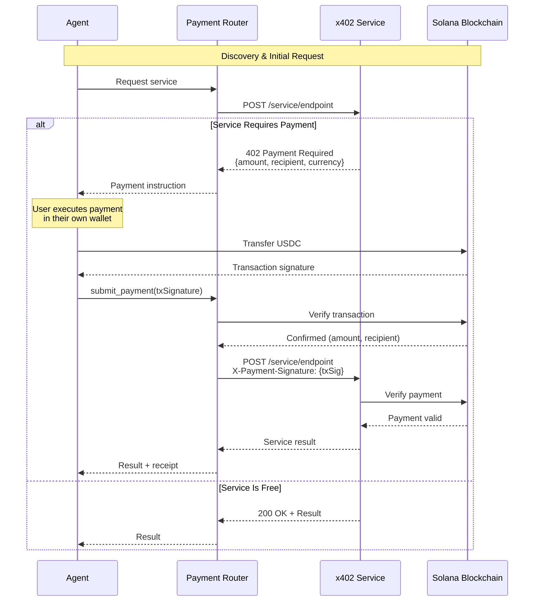
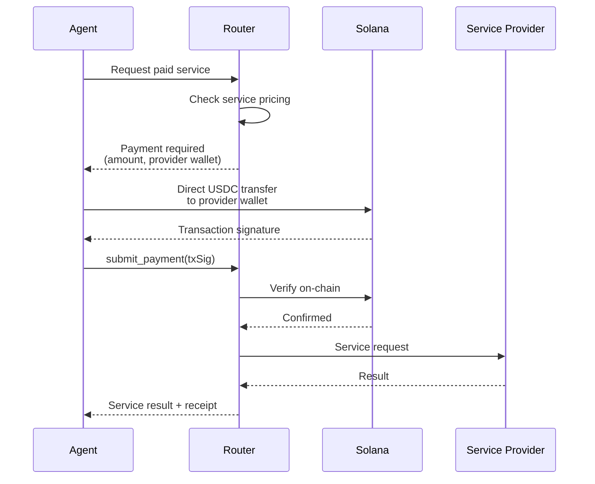
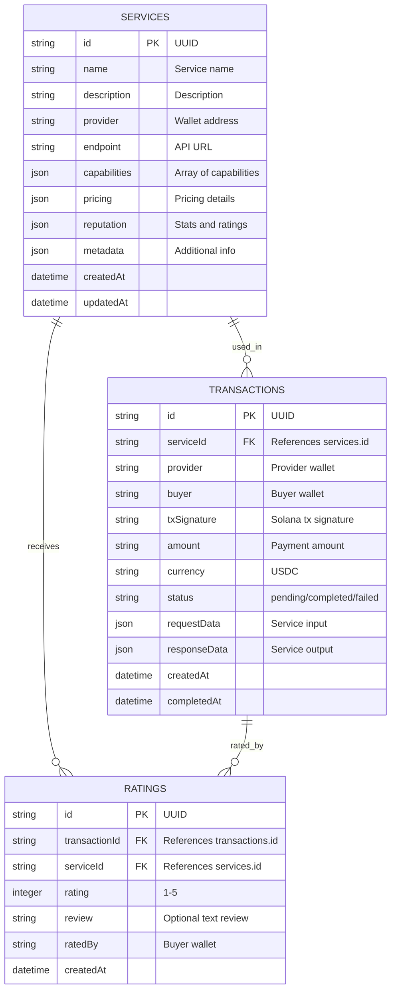
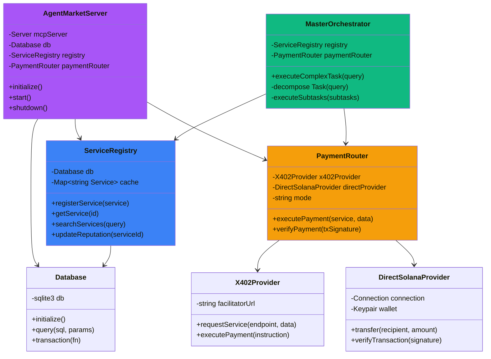

# AgentMarket Architecture

> **Generated:** 2025-11-04
> **Version:** 1.0.0
> **Last Updated:** Automated documentation generation

## Overview

AgentMarket is an AI-native service marketplace that enables autonomous AI agents to discover, purchase, and provide services using the **x402 payment protocol** and **Model Context Protocol (MCP)**. The system consists of three main components:

1. **MCP Server** - stdio-based server for Claude Desktop integration
2. **API Server** - REST API + WebSocket for real-time orchestration
3. **Web Dashboard** - Next.js frontend with 3D visualizations

## System Architecture



### Component Description

| Component | Purpose | Technology |
|-----------|---------|------------|
| **MCP Server** | Provides tools for Claude Desktop to discover and purchase services | MCP SDK, stdio transport |
| **API Server** | REST API and WebSocket for web dashboard and external integrations | Express.js, Socket.IO |
| **Master Orchestrator** | Coordinates complex multi-service workflows | Custom orchestration engine |
| **Service Registry** | Manages service listings with caching | SQLite + in-memory cache |
| **Payment Router** | Routes payments via x402 or direct Solana transfers | Solana Web3.js, x402 protocol |
| **Web Dashboard** | Real-time visualization of agent marketplace | Next.js 14, React Three Fiber |

## Data Flow



## Payment Flow

### x402 Protocol Flow



### Direct Solana Transfer Flow



## Database Schema



### Table Descriptions

#### services
Stores all registered AI service listings with metadata, pricing, and reputation.

**Key Features:**
- JSON fields for flexible metadata
- Capabilities array for multi-tag search
- Reputation tracking (totalJobs, successRate, rating)
- Multi-chain payment addresses support

**Indexes:**
- `idx_capabilities` - Fast capability-based search
- `idx_provider` - List services by provider

#### transactions
Records all service purchases and payment history.

**Key Features:**
- Links to services and stores payment proofs
- Tracks request/response data for debugging
- Status tracking (pending → completed/failed)
- Solana transaction signatures for verification

**Indexes:**
- `idx_service_transactions` - Get service history
- `idx_buyer_transactions` - Get user purchase history
- `idx_tx_signature` - Verify transaction uniqueness

#### ratings
User reviews and ratings for completed services.

**Key Features:**
- Linked to transactions (can only rate completed purchases)
- 1-5 star rating system
- Optional text reviews
- Used to calculate service reputation

**Indexes:**
- `idx_service_ratings` - Calculate average rating
- `idx_transaction_ratings` - Prevent duplicate ratings

## Component Relationships



## Technology Stack

### Backend
| Technology | Purpose | Version |
|------------|---------|---------|
| **Node.js** | Runtime environment | 22+ |
| **TypeScript** | Type-safe development | 5.9+ |
| **MCP SDK** | Model Context Protocol | 1.20+ |
| **Express.js** | REST API server | 5.1+ |
| **Socket.IO** | WebSocket for real-time | 4.8+ |
| **SQLite** | Embedded database | 5.1+ |
| **Solana Web3.js** | Blockchain interaction | 1.98+ |

### Frontend
| Technology | Purpose | Version |
|------------|---------|---------|
| **Next.js** | React framework | 14.2+ |
| **React** | UI library | 18+ |
| **Three.js** | 3D graphics | 0.164+ |
| **React Three Fiber** | React renderer for Three.js | 8.16+ |
| **Framer Motion** | Animations | Latest |
| **TailwindCSS** | Styling | 3+ |

### Blockchain
| Technology | Purpose |
|------------|---------|
| **Solana** | Layer 1 blockchain |
| **USDC** | Stablecoin for payments |
| **x402 Protocol** | HTTP-based micropayments |

### DevOps
| Technology | Purpose |
|------------|---------|
| **Docker** | Containerization |
| **Railway** | Cloud deployment |
| **GitHub Actions** | CI/CD |

## Key Design Patterns

### 1. Client-Side Payment Execution
- Server provides payment instructions
- Client executes payment in their own wallet
- Server verifies payment on-chain
- Eliminates need for server to custody user funds

### 2. Hybrid Payment Mode
- Try x402 protocol first (PayAI facilitator)
- Fallback to direct Solana transfers
- Automatic failover for reliability

### 3. In-Memory Caching
- Service registry loads all services into memory
- Reduces database queries
- Synced on updates
- Fast search and filtering

### 4. Multi-Transport Architecture
- MCP Server: stdio for Claude Desktop
- API Server: HTTP/WebSocket for web dashboard
- Same core services, different interfaces

### 5. Reputation System
- Transaction-based ratings
- Prevents fake reviews (must purchase first)
- Real-time reputation updates
- Influences service discovery ranking

## Deployment Architecture

```mermaid
graph TB
    subgraph "Railway Cloud"
        WEB[Next.js Web App<br/>Port 8080]
        API[API Server<br/>Port 8081]
        DATA[(SQLite<br/>Persistent Volume)]
    end

    subgraph "Client"
        CLAUDE[Claude Desktop<br/>MCP Client]
        BROWSER[Web Browser]
    end

    subgraph "External"
        SOL[Solana RPC<br/>Blockchain]
        SERVICES[x402 Services<br/>AI Providers]
    end

    BROWSER -->|HTTPS| WEB
    WEB -->|Internal| API
    CLAUDE -.->|stdio<br/>(local only)| MCP[MCP Server<br/>Not deployed]

    API --> DATA
    API --> SOL
    API --> SERVICES

    style WEB fill:#ec4899
    style API fill:#a855f7
    style DATA fill:#3b82f6
```

### Environment Separation

| Environment | MCP Server | API Server | Web Dashboard |
|-------------|------------|------------|---------------|
| **Local Dev** | ✅ (stdio) | ✅ (localhost:8081) | ✅ (localhost:3000) |
| **Railway** | ❌ (stdio incompatible) | ✅ (Port 8081) | ✅ (Port 8080) |

**Note:** MCP Server is designed for local use with Claude Desktop only. Railway deployment serves the API Server and Web Dashboard.

## Security Considerations

### 1. Payment Security
- No private key storage in server
- Client-side wallet management
- On-chain payment verification
- Transaction replay prevention

### 2. API Security
- JWT authentication for web API
- Rate limiting per endpoint
- CORS configuration
- Helmet.js security headers

### 3. Database Security
- Parameterized queries (SQL injection prevention)
- Transaction-level locking
- Input validation with Zod schemas

### 4. Service Security
- Provider wallet verification
- Service endpoint validation
- Request payload sanitization

## Scalability Considerations

### Current Design (Single Instance)
- In-memory cache (limited by RAM)
- SQLite (single-writer limitation)
- Suitable for: 100s of services, 1000s of transactions/day

### Future Scaling Options
1. **Horizontal Scaling**
   - Replace SQLite with PostgreSQL
   - Redis for distributed caching
   - Load balancer for multiple API instances

2. **Database Optimization**
   - Read replicas for queries
   - Write-master, read-slaves architecture
   - Database connection pooling

3. **Caching Layer**
   - Redis for service listings
   - CDN for static assets
   - Service worker caching

---

**Next Steps:**
- [API Documentation](./API.md) - Detailed API reference
- [Development Guide](./DEVELOPMENT.md) - Setup and development workflow
- [Deployment Guide](./DEPLOYMENT.md) - Production deployment instructions
